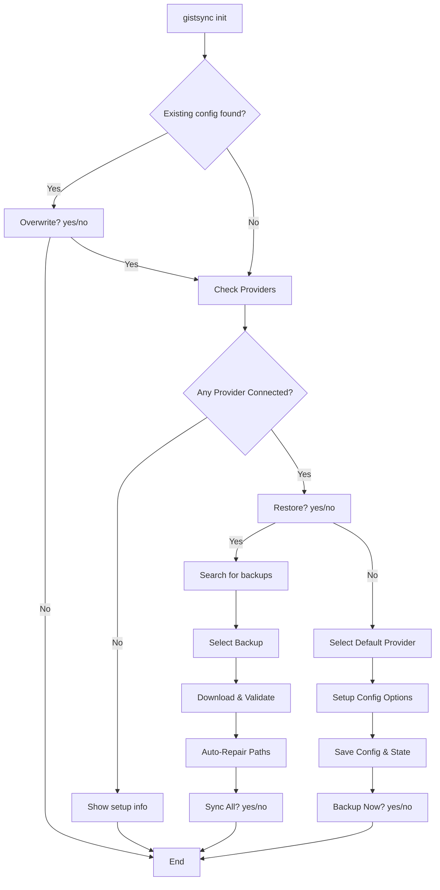

# Gistsync: Init, Standardization & Testing Guide

This document details the architectural decisions, standardized user interactions, and the automated testing framework implemented to make `gistsync` more robust and crossing-platform compatible.

## 🏁 Standardized User Prompts

One of the core UX improvements was the standardization of all interactive prompts across the CLI.

### Decisions & Behavior
1.  **Consistent Format**: All yes/no questions now use the `(yes / no)` suffix.
2.  **Default to "Yes"**: Pressing **ENTER** without typing a response is interpreted as "yes".
3.  **Refactored Utility**: We moved away from scattered `survey.Confirm` calls to a centralized `internal.Confirm` function in `internal/ui.go`.

```go
// internal/ui.go
func Confirm(message string) bool {
    fmt.Printf("%s (yes / no) ", message)
    // ... logic to handle ENTER as yes ...
}
```

## 🔄 Automated Initialization & Restoration

The `init` command was significantly enhanced to handle cross-environment restoration seamlessly.

### Automated Path Repair
When restoring a configuration from a remote backup (GitHub Gist), `gistsync` may encounter paths that belong to a different OS or user (e.g., `/Users/karan/...` vs `/home/user/...`).

-   **Decision**: Instead of bothering the user with manual repair prompts, the tool now **auto-repairs** these paths by remapping home-relative directories to the current machine's home.
-   **Placeholder Fix**: Any state files containing `PENDING` remote IDs (usually from interrupted syncs) are automatically corrected with the specific Gist ID used during restoration.

### Flow Diagram: `gistsync init`



### Post-Restoration Sync
Immediately after a successful restore and repair, the tool offers to run a full sync. This ensures the local machine is perfectly in sync with the cloud state without requiring a separate `gistsync sync` command.

## 🧪 Automated Testing Framework

To ensure these complex flows remain stable, we implemented a bash-based test suite in the `tests/` directory.

### How Tests Work without `--yes`
We briefly explored a `--yes` flag for non-interactive use but decided to **revert** it to keep the core tool simple and purely interactive.

-   **Piped Input**: The test scripts use `printf` to pipe simulated keypresses into the tool. 
    -   Example: `printf "n\n\n\n\n\n" | ./gistsync init` (Simulates No for restore, then 5 ENTERs for settings).
-   **Cleanup**: The `run_tests.sh` master script ensures all temporary test gists created on GitHub are deleted using `gh gist delete --yes`.

### Key Test Coverage
-   **`test_init.sh`**: Fresh setup vs. Restore flow.
-   **`test_sync.sh`**: 2-way sync, conflict detection, and **Path Flattening** (e.g., `folder/file.txt` becomes `folder---file.txt` in Gist).

## ❓ FAQ

**Q: Why don't I see the "Overwrite?" prompt?**
**A**: This prompt only appears if a `config.json` already exists in your configuration directory (`~/.config/gistsync`).

**Q: How does path flattening work?**
**A**: When syncing a directory, `gistsync` replaces path separators with `---`. This allows mapping a local directory structure into a flat Gist file list while preserving the ability to recreate the structure during a pull.

**Q: What happens if I have multiple backups?**
**A**: `gistsync init` will list all backups found on the provider, sorted by updated time (latest first). You can select which one to restore.
