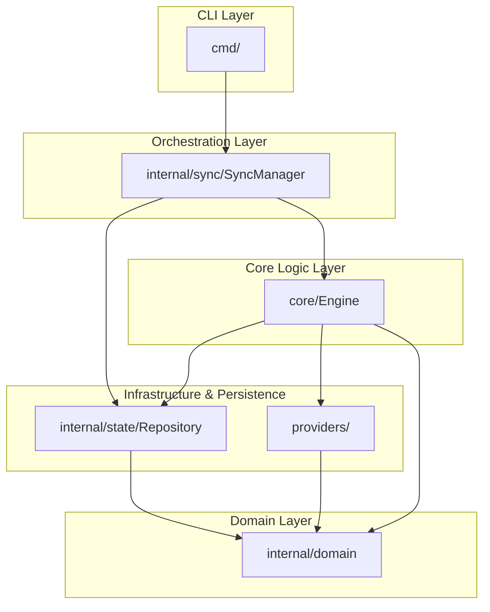

# Architectural Evolution: Transforming gh-gist-syncer into a Resilient System

Refactoring a codebase like `gh-gist-syncer` into a "Staff Engineer" quality project requires moving beyond "making it work" to "making it resilient, modular, and beautiful." This document outlines the architectural shifts and design patterns used to transform the repository.

## The Problem Statement
In its original form, the codebase suffered from:
- **Tight Coupling**: The `Engine` handled everything from CLI flags to sync logic and persistence.
- **Logic Duplication**: CLI commands often repeated setup and validation logic.
- **Indirect State Management**: Hard-coded file paths and manual I/O throughout the app.

---

## 1. The Architectural Blueprint: Layered Separation
We transitioned to a **Layered Architecture**. This ensures that each package has a single, well-defined responsibility, making the system easier to test and extend.



### The Layers:
- **Domain Layer ([internal/domain](file:///Users/karan/projects/Personal_projects/gh-gist-syncer/internal/domain/models.go))**: The "source of truth." It contains pure data structures (`State`, `Mapping`, `File`) with no external dependencies.
- **Repository Layer ([internal/state](file:///Users/karan/projects/Personal_projects/gh-gist-syncer/internal/state/repository.go))**: Abstracts the "how" of persistence. The business logic doesn't care if state is in JSON or a database.
- **Core Layer ([core](file:///Users/karan/projects/Personal_projects/gh-gist-syncer/core/engine.go))**: The "pure logic" engine. It determines *what* needs to be synced using hashes, remaining agnostic of providers.
- **Orchestration Layer ([internal/sync](file:///Users/karan/projects/Personal_projects/gh-gist-syncer/internal/sync/manager.go))**: The `SyncManager` connects CLI commands to the Core and Repository.

---

## 2. Strategic Design Patterns

### Repository Pattern
Originally, the `Engine` manually read/wrote `state.json`. Now, we use the `Repository` interface:
```go
type Repository interface {
    Load() (*domain.State, error)
    Save(state *domain.State) error
    WithLock(fn func(state *domain.State) error) error
}
```
**Staff Perspective**: By centralizing persistence, we implemented **Atomic Writes** and **File Locking** in one place, protecting data from corruption during concurrent syncs.

### Orchestrator (Manager) Pattern
The `SyncManager` serves as a "thin wrapper" for CLI commands.
- **Why**: Logic like `SyncPath()` or `Status()` is reusable. If we change how a sync works, every command (CLI, Autostart, UI) benefits immediately.

### Strategy Pattern
We defined a `Provider` interface in `internal/domain`:
```go
type Provider interface {
    Fetch(remoteID string) ([]File, error)
    Create(files []File, public bool) (string, error)
    // ...
}
```
**Why**: This decouples the engine from specific backends. Adding `GitLab` support (in `providers/`) requires zero changes to the `core/Engine`.

### Dependency Injection (DI)
By passing the `Repository` and `Provider` into constructors, we decoupled implementation from usage.
- **Impact**: This is the secret to testability. We can inject "Mocks" to simulate network failures without an internet connection.

---

## 3. "Clean Code" & Go Idioms

- **Standardized Types**: Every layer speaks in `domain.File`, ensuring a consistent "language" across the app.
- **Error Wrapping**: Instead of generic errors, we use `fmt.Errorf("context: %w", err)`. This preserves the original error stack while providing human-readable context.
- **Defensive Programming**: We prioritize `WriteAtomic` in the `storage` package. This ensures that even a crash mid-operation won't leave `config.json` corrupted.

---

## 4. The "Staff Level" Polish
Beyond code structure, we focused on the **Developer & User Experience**:

1. **I18n (Internationalization)**: All strings live in `en.json`. This ensures a unified voice across the CLI.
2. **Centralized Progress Reporting**: The `SyncManager` handles status messages, giving the terminal output a professional, consistent feel.
3. **Graceful Failures**: Instead of nil pointer dereferences, the tool provides helpful hints (e.g., *"Path not tracked"*) via robust validation logic.

**In summary**: The codebase is no longer a single tangled thread, but a system of **pluggable, resilient components**.

