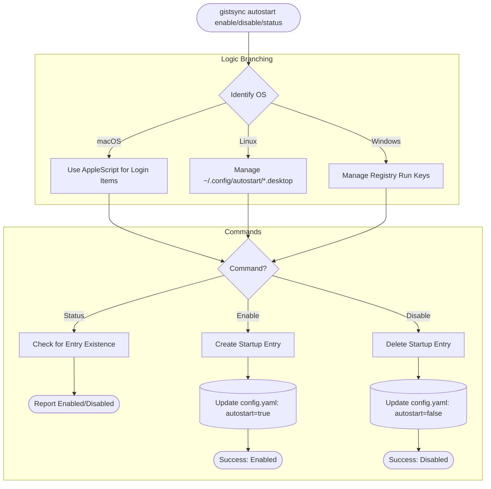

# Autostart Flow

The `autostart` command manages the automated launching of `gistsync` upon user login, utilizing platform-specific mechanisms.

### OS Implementation Details
- **macOS**: Uses `osascript` to add/remove login items for the current user.
- **Linux**: Creates a `.desktop` file in the user's autostart directory.
- **Windows**: (Future/MVP support) Interacts with the `CurrentVersion\Run` registry key.
- **Config Sync**: The autostart preference is saved in `config.yaml`, ensuring it can be synced across machines via `config sync`.
