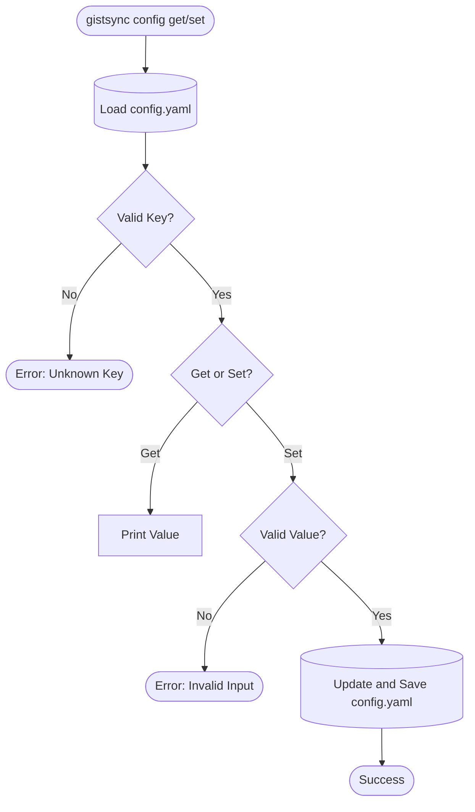
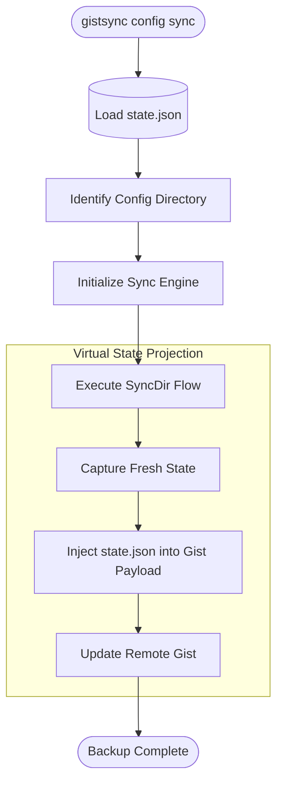
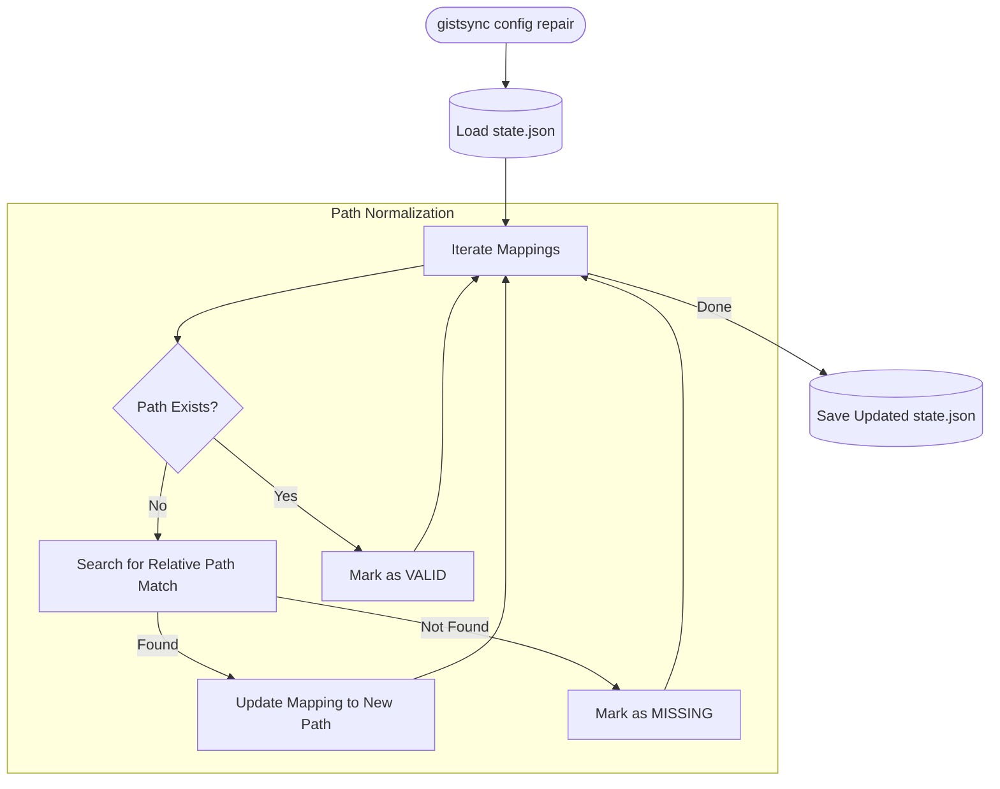

# Config Management Flow

The `config` command suite handles user preferences, cloud backups, and cross-platform path migration.

## Get / Set Flow

## Config Sync (Backup/Restore)

## Config Repair

