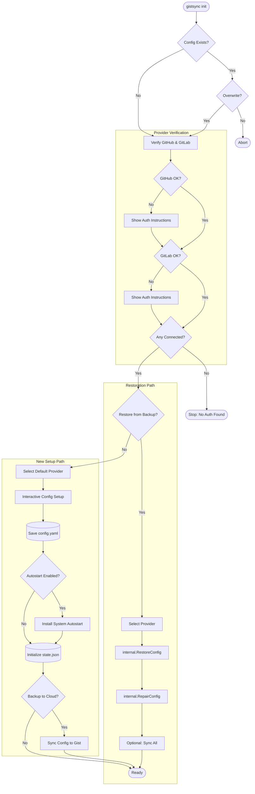

# Init Flow

The `init` command sets up the environment, authenticates providers, and establishes the initial state for synchronization.

```mermaid
graph TD
    Start([gistsync init]) --> CheckConfig{Config Exists?}
    CheckConfig -- Yes --> ConfirmOverwrite{Overwrite?}
    ConfirmOverwrite -- No --> Abort([Abort])
    ConfirmOverwrite -- Yes --> VerifyProviders
    CheckConfig -- No --> VerifyProviders

    subgraph "Provider Verification"
    VerifyProviders[Verify GitHub & GitLab] --> GH_Status{GitHub OK?}
    GH_Status -- Yes --> GL_Status{GitLab OK?}
    GH_Status -- No --> GH_Warn[Show Auth Instructions] --> GL_Status
    GL_Status -- Yes --> CheckConnected{Any Connected?}
    GL_Status -- No --> GL_Warn[Show Auth Instructions] --> CheckConnected
    end

    CheckConnected -- No --> Stop([Stop: No Auth Found])
    CheckConnected -- Yes --> WantRestore{Restore from Backup?}

    subgraph "Restoration Path"
    WantRestore -- Yes --> SelectRestore[Select Provider]
    SelectRestore --> Restore[internal.RestoreConfig]
    Restore --> Repair[internal.RepairConfig]
    Repair --> InitialSync[Optional: Sync All]
    InitialSync --> Ready([Ready])
    end

    subgraph "New Setup Path"
    WantRestore -- No --> SelectDefault[Select Default Provider]
    SelectDefault --> InputConfig[Interactive Config Setup]
    InputConfig --> SaveConfig[(Save config.yaml)]
    SaveConfig --> AutoStart{Autostart Enabled?}
    AutoStart -- Yes --> InstallAuto[Install System Autostart] --> InitState
    AutoStart -- No --> InitState
    InitState[(Initialize state.json)] --> WantBackup{Backup to Cloud?}
    WantBackup -- Yes --> CloudBackup[Sync Config to Gist] --> Ready
    WantBackup -- No --> Ready
    end
```
