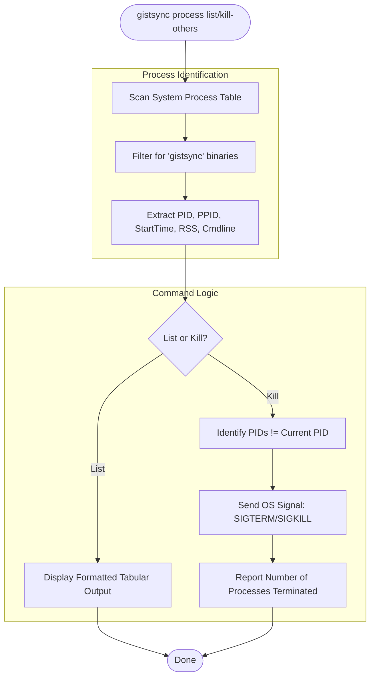

# Process Management Flow

The `process` command allows users to monitor and control background synchronization processes.

### Purpose
- **List**: Useful for checking if the `watch` command is running correctly in the background.
- **Kill-others**: Essential for resolving "zombie" processes or ensuring only one sync engine is active.
