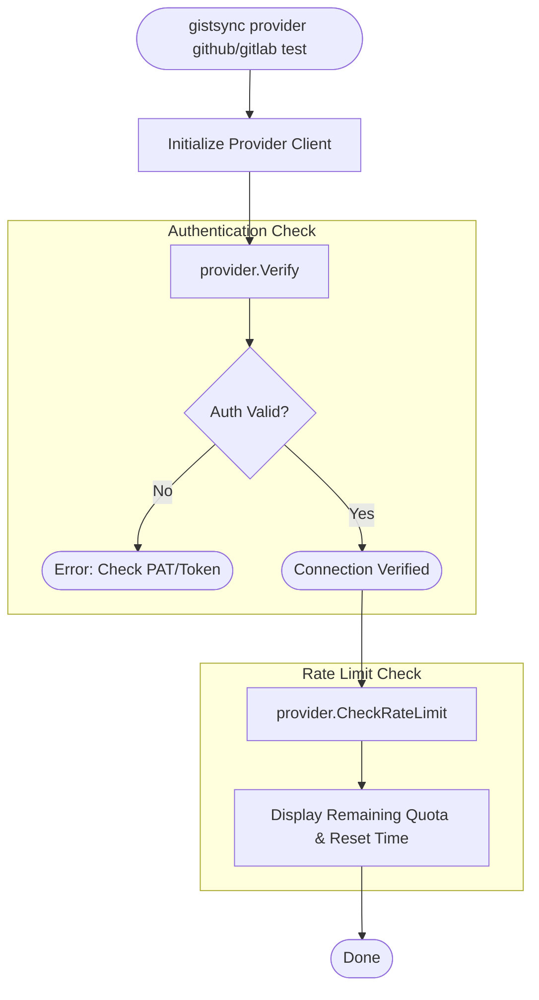

# Provider Health Flow

The `provider` command allows users to verify their authentication and monitor API usage limits.

## Provider Info
The `provider info` command simply prints a predefined guide for obtaining Personal Access Tokens (PATs) for both GitHub and GitLab, pointing users to the correct settings URLs.
