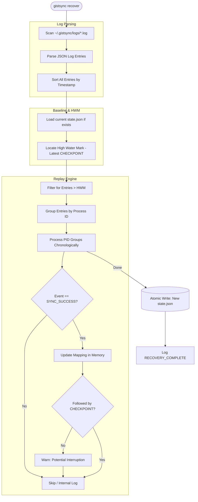

# State Recovery (WAL Replay) Flow

The `recover` command uses a Write-Ahead Logging (WAL) strategy to reconstruct a corrupted or missing `state.json` from historical activity logs.

### Technical Details
- **WAL Concept**: Every successful sync logs a `SYNC_SUCCESS` event containing the path, hash, and gist ID. These logs act as the source of truth for reconstruction.
- **HWM (High Water Mark)**: A `CHECKPOINT` log entry indicates that `state.json` was safely persisted to disk. Recovery only needs to replay events that happened *after* the last known checkpoint.
- **Interruption Detection**: If a `SYNC_SUCCESS` is logged without a subsequent `CHECKPOINT`, it implies the process crashed *before* saving the state. The user is warned, but the mapping is still applied as the provider state is likely updated.
