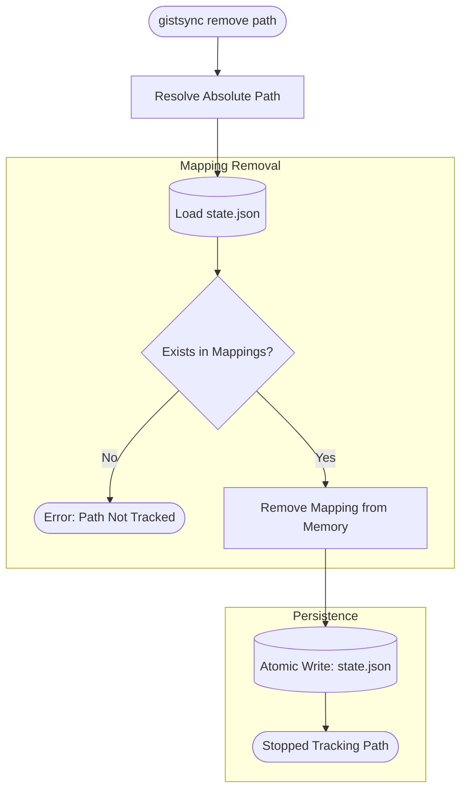

# Remove Flow

The `remove` command stops `gistsync` from tracking a specific local file or directory. Note that this does NOT delete the remote Gist; it only removes the association from the local state.

### Important Notes
- **Remote Data**: The remote Gist remains intact on GitHub/GitLab. If you wish to delete the Gist as well, you must do so through the provider's web interface or specialized tool.
- **Safety**: The removal is atomic; either the mapping is removed and saved, or the state remains unchanged.
