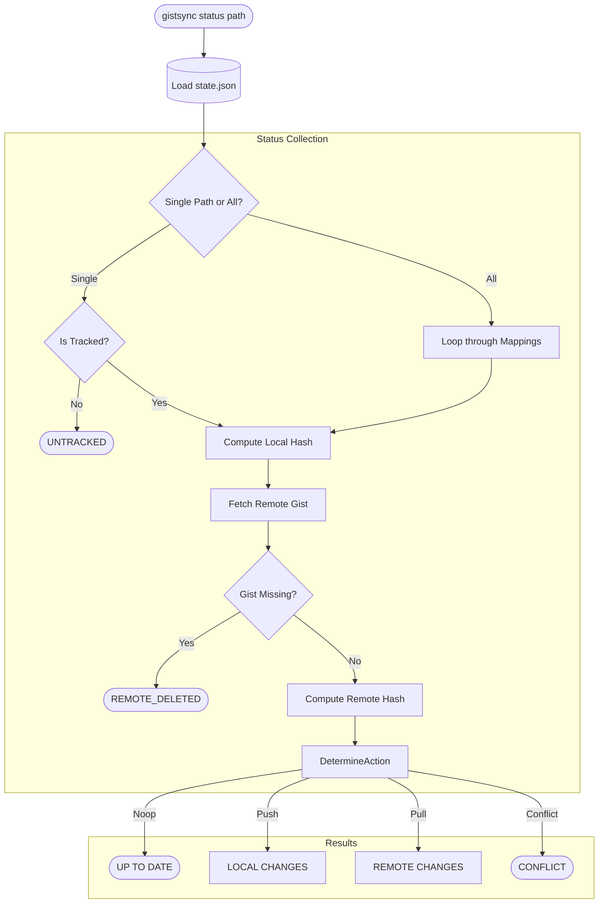

# Status Flow

The `status` command provides a quick overview of the health and synchronization state of your tracked files.

### Interpretation
- **UP TO DATE**: Local, Remote, and LastSynced hashes all match.
- **LOCAL CHANGES**: Local file was modified; next sync will PUSH.
- **REMOTE CHANGES**: Gist was modified online; next sync will PULL.
- **CONFLICT**: Both local and remote have changed since the last sync.
