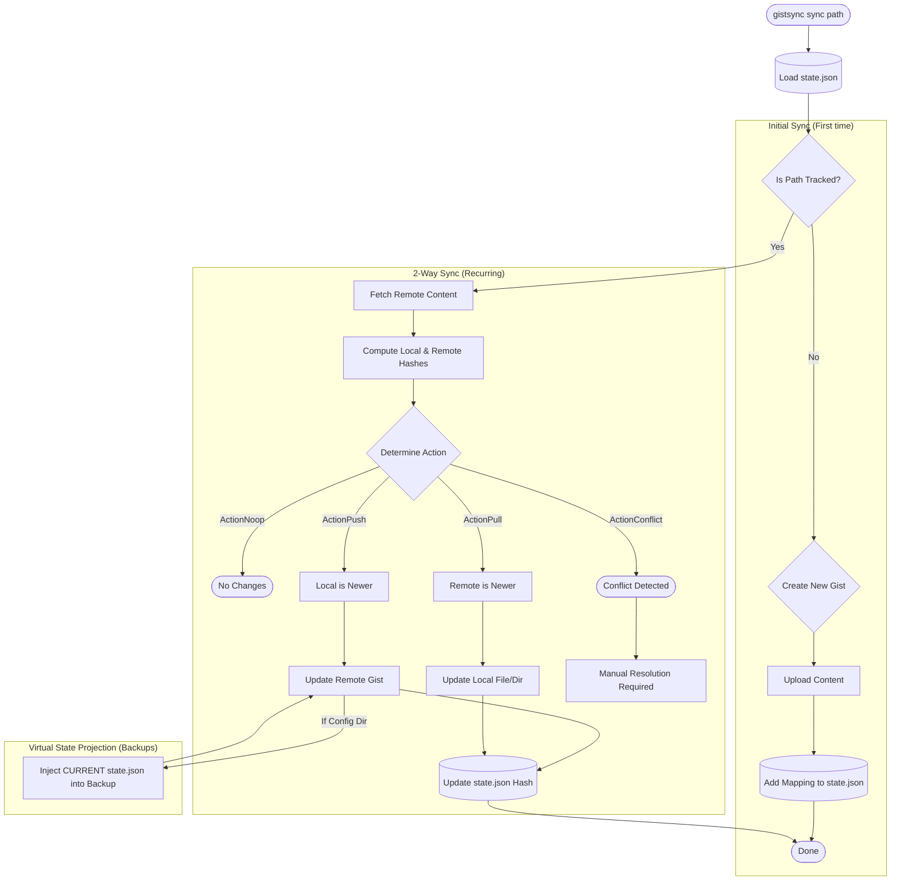

# Sync Flow

The `sync` command is the core engine, performing 2-way hash-based synchronization between local files and remote Gists.

### Action Determination Logic
| Local == Remote | Local == Last | Remote == Last | Action |
| :--- | :--- | :--- | :--- |
| Yes | - | - | **NOOP** (Already in sync) |
| No | Yes | No | **PULL** (Remote changed) |
| No | No | Yes | **PUSH** (Local changed) |
| No | No | No | **CONFLICT** (Both changed) |
