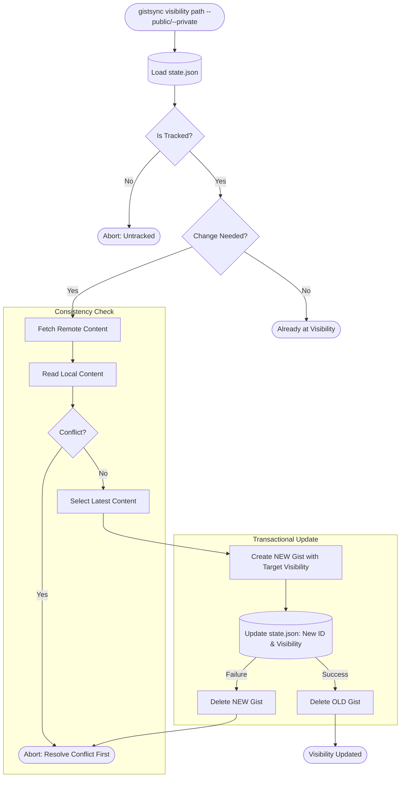

# Visibility Transition Flow

Changing a Gist's visibility (public <-> private) requires creating a new Gist because providers like GitHub do not allow visibility toggling on existing Gists.

### Risk Mitigation
- **Atomic State Update**: The new Gist ID is only committed to local state if the entire transaction succeeds.
- **Rollback**: If saving the local state fails, the newly created Gist is automatically deleted to prevent orphaned "shadow" Gists.
- **Cleanup**: The old Gist is only deleted after the local state has been successfully updated with the new Gist's information.
