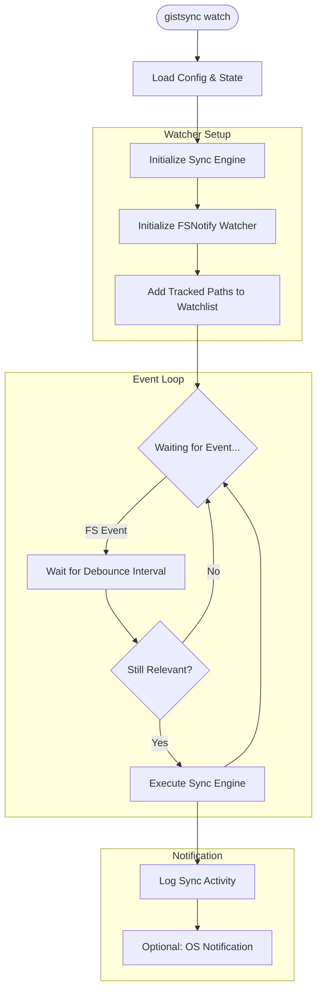

# Watcher Flow (Background Sync)

The `watch` command starts a long-running background process that monitors the filesystem for changes and triggers synchronization automatically.

### Key Parameters
- **WatchInterval**: Frequency of checking for changes (though mostly event-driven).
- **WatchDebounce**: Milliseconds to wait after the last change before triggering a sync, preventing redundant uploads during rapid edits.
- **State Resilience**: The watcher reloads state if it receives a SIGHUP or similar reload signal (implementation dependent).
